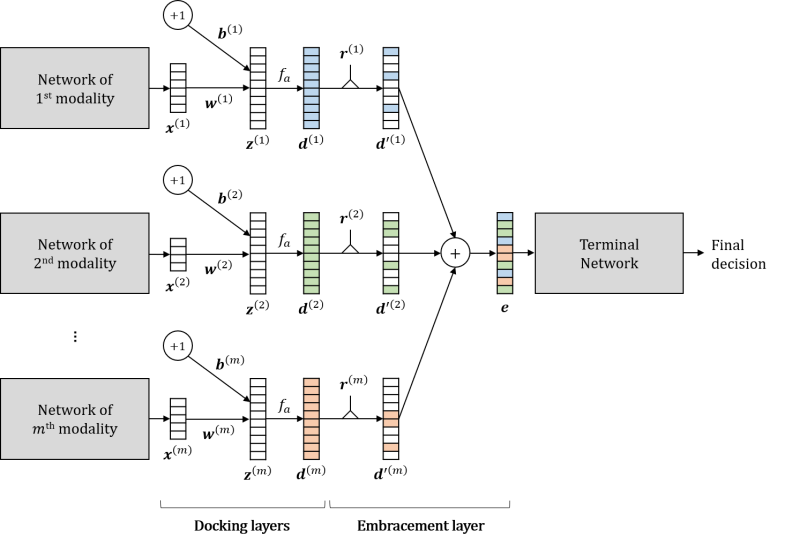

# EmbraceNet: A robust deep learning architecture for multimodal classification




## News

- Our method "[EmbraceNet for Activity](https://dl.acm.org/citation.cfm?id=3344871)" won the 2nd place (1st in deep learning-based approaches) in the [SHL recognition challenge 2019](http://www.shl-dataset.org/activity-recognition-challenge-2019/). **[[Paper]](https://dl.acm.org/citation.cfm?id=3344871)** **[[Challenge paper]](https://dl.acm.org/citation.cfm?id=3344872)**


## Introduction

EmbraceNet is a novel multimodal integration architecture for deep learning models, which provides good compatibility with any network structure, in-depth consideration of correlations between different modalities, and seamless handling of missing data.
This repository contains the official PyTorch- and TensorFlow-based implementations of the EmbraceNet model, which is explained in the following paper.
- J.-H. Choi, J.-S. Lee. EmbraceNet: A robust deep learning architecture for multimodal classification. Information Fusion, vol. 51, pp. 259-270, Nov. 2019 **[[Paper]](https://doi.org/10.1016/j.inffus.2019.02.010)** **[[arXiv]](https://arxiv.org/abs/1904.09078)**
```
@article{choi2019embracenet,
  title={EmbraceNet: A robust deep learning architecture for multimodal classification},
  author={Choi, Jun-Ho and Lee, Jong-Seok},
  journal={Information Fusion},
  volume={51},
  pages={259--270},
  year={2019},
  publisher={Elsevier}
}
```


## Dependencies

### PyTorch-based
- Python 3.7+
- PyTorch 1.5+

### TensorFlow-based
- Python 3.6+
- TensorFlow 1.8+ (<2.0)


## Getting started

The implementations of the EmbraceNet model is in the [```embracenet_pytorch/```](embracenet_pytorch/) and [```embracenet_tf1/```](embracenet_tf1/) folders.
Copy the appropriate folder for your framework to your code base and import it.
```python
# for PyTorch-based
from embracenet_pytorch import EmbraceNet

# for TensorFlow-based
from embracenet_tf1 import EmbraceNet
```
Here is a code snippet to employ EmbraceNet.

### PyTorch-based
```python
device = torch.device('cuda' if torch.cuda.is_available() else 'cpu')

# Build a pre-processing network for each modality.
# Assume that there are two pre-processed modalities (modality1, modality2) having sizes of 512 and 128.

# Create an EmbraceNet object.
embracenet = EmbraceNet(device=device, input_size_list=[512, 128], embracement_size=256)

# Feed the output of the pre-processing network to EmbraceNet at the "forward" function of your module.
embraced_output = embracenet(input_list=[modality1, modality2]))

# Employ a post-processing network with inputting embraced_output.
```

Please refer to the comments in [```embracenet_pytorch/embracenet.py```](embracenet_pytorch/embracenet.py) for more information.

### TensorFlow-based
```python
# Create an EmbraceNet object.
embracenet = EmbraceNet(batch_size=16, embracement_size=256)

# Build a pre-processing network for each modality.
# Then, feed the output of the pre-processing network to EmbraceNet.
embracenet.add_modality(input_data=modality1, input_size=512)
embracenet.add_modality(input_data=modality2, input_size=128)

# Integrate the modality data.
embraced_output = embracenet.embrace()

# Build a post-processing network with inputting embraced_output.
```

Please refer to the comments in [```embracenet_tf1/embracenet.py```](embracenet_tf1/embracenet.py) for more information.


## Examples

Example codes that employ EmbraceNet to build classifiers of [Fashion MNIST](https://github.com/zalandoresearch/fashion-mnist) are included in the [```examples/fashion_mnist_pytorch/```](examples/fashion_mnist_pytorch/) and [```examples/fashion_mnist_tf1/```](examples/fashion_mnist_tf1/) folders.
